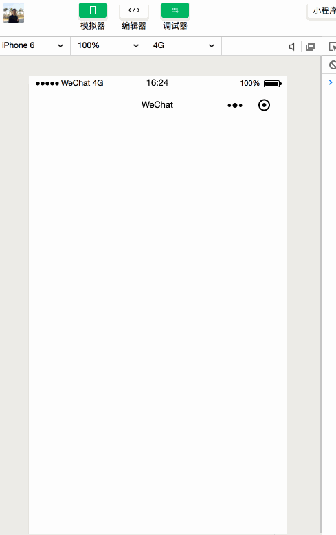

# antv/f2 wepy

> antv/f2 小程序 wepy 组件版本



## 使用

> 安装

```sh
npm install wepy-antv-f2
```

> template

```html
<!-- 这里的长宽属性 是按照 iPhone6 作为设计稿标准(宽度750px) -->
<F2Canvas :opts="opts" canvasId="circle" width="750" height="400"></F2Canvas>
```

> script

```js
import F2Canvas from 'wepy-antv-f2/F2Canvas';
// antv f2 抽离到 mini-program-utils, 都经过babel 编译
import F2 from 'mini-program-utils/dist/f2/adapterF2';

let chart = null;

const initChart = (canvas, width, height) => {
  const data = [
    { year: '1951 年', sales: 38 },
    { year: '1952 年', sales: 52 },
    { year: '1956 年', sales: 61 },
    { year: '1957 年', sales: 145 },
    { year: '1958 年', sales: 48 },
    { year: '1959 年', sales: 38 },
    { year: '1960 年', sales: 38 },
    { year: '1962 年', sales: 38 }
  ];
  chart = new F2.Chart({
    el: canvas,
    width,
    height
  });

  chart.source(data, {
    sales: {
      tickCount: 5
    }
  });
  chart.tooltip({
    showItemMarker: false,
    onShow(ev) {
      const { items } = ev;
      items[0].name = null;
      items[0].name = items[0].title;
      items[0].value = '¥ ' + items[0].value;
    }
  });
  chart.interval().position('year*sales');
  chart.render();
  return chart;
};

export default class Index extends wepy.page {
  components = {
    F2Canvas
  };
  data = {
    opts: {
      onInit: initChart
    }
  };
}
```

## 文档

- [antv/f2 文档](https://antv.alipay.com/zh-cn/f2/3.x/tutorial/index.html)
- [antv 官方原生小程序 组件](https://github.com/antvis/wx-f2)
